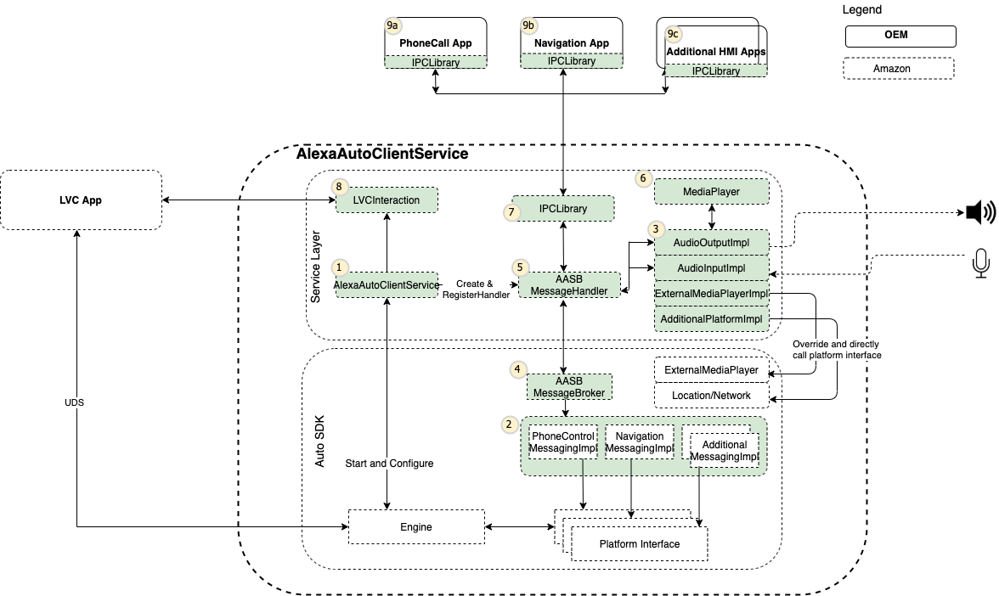
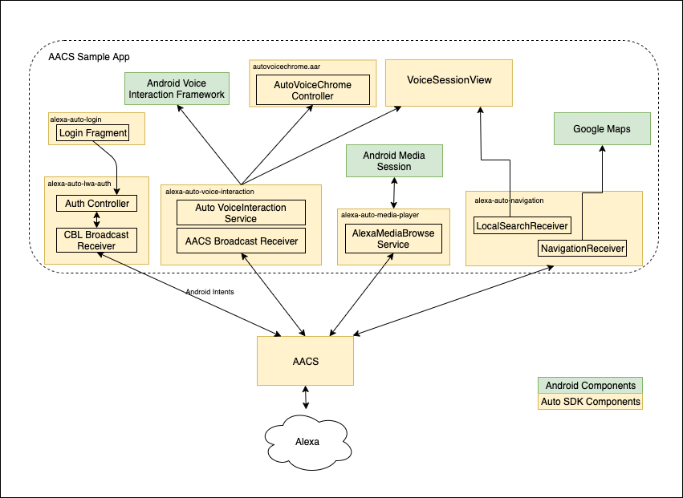

# Aptiv Alexa App Design with Alexa SDK 3.0 and higher

Alexa Auto Client Service (AACS) is an Alexa Auto SDK feature packaged in an Android application package (APK). By providing a common service framework, AACS simplifies the integration of the Auto SDK with your Android device and supports all the Auto SDK extensions.

AACS App is built as part of the Alexa Auto SDK. Our Aptiv Alexa App communicates with AACS through an intent, which is a messaging object on an Android device.AACS provides the platform implementation for certain interfaces, which speeds up Alexa integration for in-vehicle infotainment (IVI). Without AACS i.e before Alexa SDK 3.0 , typical integration of the Auto SDK in the IVI involves the implementation of abstract interfaces provided by each Auto SDK module to handle platform-specific functionality. To implement all required platform interfaces, the Auto SDK is integrated to an event-based system that converts from direct method APIs to an event-based architecture.

The typical architecture of AACS App is shown below. The shaded boxes in the diagram represent components developed by Amazon that are packaged in AACS. The MessagingImplementation, MessageBroker, and MessageHandler services make up the Alexa Auto Service Bridge (AASB) extension.

The typical architecture of Aptiv Alexa App is shown below. It interacts with AACS App which in turn talks to Alexa on cloud. The APK contains app components, each of which consists of the compiled source code or resources used by the app to provide the UI layout, communicate with AACS, and so on. The following list shows the contents of the app-components directory:

* alexa-auto-apis
* alexa-auto-apps-common-ui
* alexa-auto-apps-common-util
* alexa-auto-login
* alexa-auto-lwa-auth
* alexa-auto-media-player
* alexa-auto-voice-interaction
* alexa-auto-navigation

