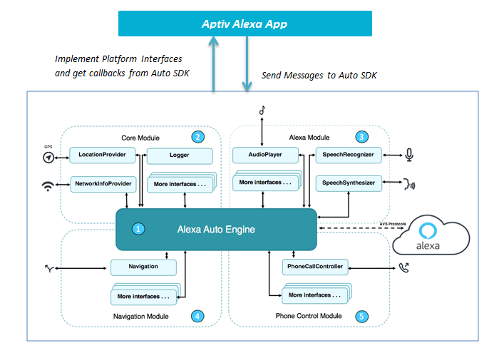
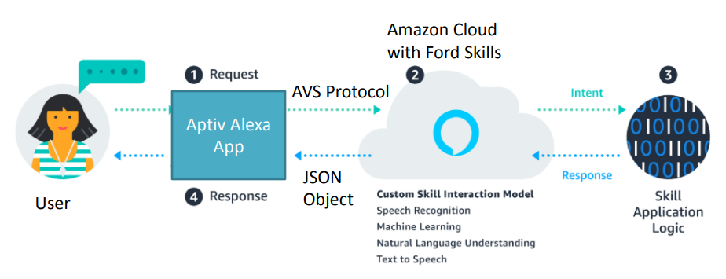

# Overview of the Aptiv Alexa Application

The Alexa Auto SDK provided by Amazon contains essential client-side software required to integrate Alexa into the automobile. The Auto SDK is modular and abstract, providing a runtime engine for your vehicle to communicate with the Alexa service. It also provides interfaces to implement platform-specific behavior, such as audio input, media playback, template and state rendering, phone control, and navigation. After you build and install the Auto SDK, you can use the Aptiv Alexa App in Android, to test the Auto SDK interfaces and interact with Media, Navigation, Radio and other modules on Platform using Alexa.

# Aptiv Alexa App Design

Aptiv Alexa App interacts with Alexa SDK modules to send and receive messages for media, navigation, phone call etc. The below design provides a brief overview for the same.

> **Note**: This diagram shows only some of the available platform interfaces.

# Aptiv Alexa App Login

User can start using Alexa after successful login. Code Based Linking (CBL) is an authentication mechanism used by Amazon Alexa for users. 

This techique consists of the below steps

* Step 1: User opens Alexa App
* Step 2: Request Permissions for Mic, Phone Calls, Messages, Audio etc
* Step 3: Give an overview of what Alexa can do
* Step 4: Generate a 6 digit code also called CBL code for user authorization. Display the Amazon URL along with code for login
* Step 5: User enters the Amazon URL in the browser of any device PC, mobile etc along with CBL code.
* Step 6: After sometime Login Completes, user can now start using Alexa in the vehicle.

# Aptiv Alexa App Integration with Custom Skill

The Alexa Skills can be invoked and handled as part of the Aptiv Alexa App. The App sends the users request through voice to the cloud using AVS( Alexa Voice Service ) protocol. The Cloud then converts the request to an intent using NLU Techniques. The Skill Invocation logic is triggered and it gives the response back to cloud. The Cloud returns the response back to Aptiv Alexa App via a Template Runtime Handler. The App then tells the User about the skill response.

The below daigram gives an overview of the same

  
